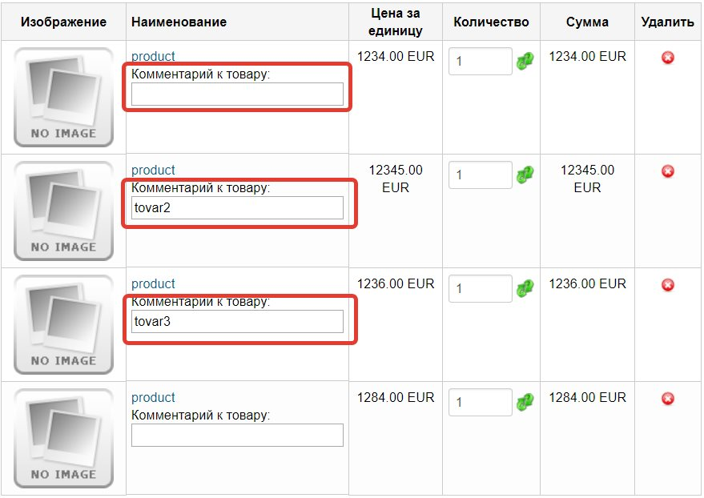

# jshopping_additional_note
Добавляет дополнительное поле для комментирования для каждого товара в корзине ( по типу оставить заметку к товару). Проверялось на Joomshopping 4.15 + Joomla 3.8

Порядок установки:
1) Установить как плагин через менеджер расширений Joomla (Запаковать 2 файла additional_note.php и additional_note.xml в zip-архив
2) Добавить в файл шаблона корзины /components/com_jshopping/<имя шаблона>/default/cart/cart.php 

`<input type="hidden" id="note_id" name="note_id" />`

перед закрывающимся тегом </form>
3) Добавить в файл шаблона отправки сообщения /components/com_jshopping/<имя шаблона>/default/checkout/orderemail.php

`
				<?php if ($prod->additional_note != '') : ?>
				
Комментарий к товару: <?php echo $prod->additional_note; ?>

				<?php endif; ?>
`

в любое удобное место в цикле foreach товаров, к примеру после <?php print $prod->product_name; ?>
